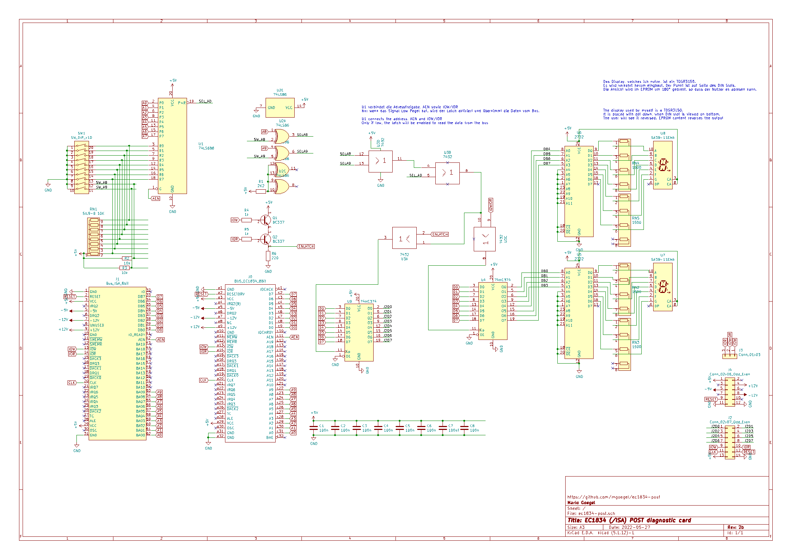

# Robotron EC1834 POST 60h (und nicht nur Port 60) ISA Karte

In diesem projekt möchte ich euch meine ISA Port 60h Karte für den EC1834 vorstellen.

Das Projekt wurde inspiriert von dieser Version:
https://bbright.tripod.com/information/postcard.htm
sowie von der ELV 1995-04 ISA-BIOS-POST Karte.

## Beschreibung

### Decoder
Die Platine nutzt 2 EPROMS zum dekodieren des 8 Bit Hex Werts auf 2 7-Segment Displays.
Es gibt ganz klar bessere Wege, um dies zu erreichen (Hex Decoder oder PAL/GALs).
Beide Techniken sind veraltet und/oder schwer verfügbar (wie auch die 2 EPROMS 2732).
Aber dies war die einfachste und schnellste verfügbare Lösung für mich. 
Ich schließe keine bessere Version für die Zukunft aus. ;-)

### Konfiguration
Um 74LS(688) ICs zu unterstützen, nutzte ich Pull Up Widerstände zur Konfiguration.
Dadurch müssen die Adressleitungen, welche NICHT verglichen werden sollen, am DIP Switch auf **ON** 
geschaltet und so auf Masse gezogen werden.
Nebenbei - der DIP Switch kann durch eine Jumperreihe ersetzt werden.
Jumper müssten in diesem Fall gesetzt werden!

Beispiel:

* Adresse 0x80 - Leitungen A0-A6,A8-A9 müssen auf **ON**; A7 auf **OFF**
* Adresse 0x60 - Leitungen A0-A4,A7-A9 müssen auf **ON**; A5,A6 auf **OFF**

Der verfügbare Adressbereich ist von 0x000-0x3ff

Das Display kann statt auf Schreib- auf Leseanforderungen konfiguriert werden.
Dazu muss Jumper J3 von der Standard-Einstellung "Write" auf "Read" gesetzt sein.

### Verbinder
Die Platine hat 2 besondere Steckverbinder.
Der Spannungsverbinder J4 soll Optional ein Spannungsmonitoring bieten. Er bietet einfachen Zugriff auf alle Bus Spannungen (+/- 5V, +/-12V, GND) des ISA Busses.

Verbinder J2 bietet einen einfachen Zugang für einen Logic Analyzer. Die Busa Daten werden für Schreib- und Lesezugriff angeboten.
Zusätzlich sind die IOW/IOR Leitungen vorhanden, so dass man am Analyzer die entsprechende Aktion (Low Pegel) zuordnen kann.

J0 kann als DIN41612 64pin (a+c) ausgeführt werden, da kein Zugriff auf den 16bit Datenbus nötig ist.

## BOM

| Ref | Value               |
|-----|---------------------|
| C1  | 100n                |
| C2  | 100n                |
| C3  | 100n                |
| C4  | 100n                |
| C5  | 100n                |
| C6  | 100n                |
| C7  | 100uF               |
| C8  | 100n                |
| J0  | DIN 41612C 64(a+c) oder 96 pin (abc)  female 90° THT connector  |
| J2  | Conn_02x07_Odd_Even |
| J3  | Conn_01x03          |
| J4  | Conn_02x06_Odd_Even |
| Q1  | BC337               |
| Q2  | BC337               |
| R1  | 2K2                 |
| R2  | 10k                 |
| R3  | 10k                 |
| R4  | 1k                  |
| R5  | 1k                  |
| R6  | 220                 |
| RN1 | SIL9-8 10K          |
| RN2 | SIL5-4 1,5k oder 4x1,5K R |
| RN3 | SIL5-4 1,5k oder 4x1,5K R |
| RN4 | SIL5-4 1,5k oder 4x1,5K R |
| RN5 | SIL5-4 1,5k oder 4x1,5K R |
| SW1 | SW_DIP_x10          |
| U1  | 74LS688             |
| U2  | 74LS86              |
| U3  | 7432                |
| U4  | 74HC374             |
| U5  | 2732                |
| U6  | 2732                |
| U7  | SA39-11EWA oder TDSR3150  |
| U8  | SA39-11EWA oder TDSR3150  |
| U9  | 74HC374             |

